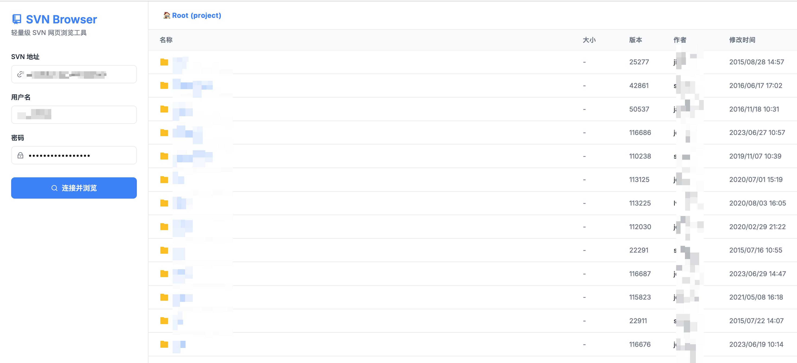

# SVN Web Browser

**English** | [中文](./README_zh.md)

## Introduction
This is a lightweight, asynchronous, and modern UI web-based SVN browser. 
It uses a minimalistic PHP backend to securely interact with the `svn` command line, and pure vanilla HTML/CSS/JS to provide a smooth, responsive frontend experience. It requires no heavy frameworks—only a server with PHP and SVN installed, making it completely **plug-and-play**.



## 🌟 Features
- **Pure & Minimalistic**: Zero third-party NPM packages, no complex Node.js setups, and no database required.
- **Dynamic Tree Browsing**: After connecting with your credentials, everything loads asynchronously. Click any directory to enter it, and use the "breadcrumbs" navigation to instantly jump back to parent levels.
- **In-Browser File Viewing**: Built-in plain-text code preview. Click on any file (e.g. code or document) to preview its content directly on the page (utilizing the `svn cat` command) without leaving the application.
- **Comprehensive Commit Info**: Accurately parses SVN XML output to properly display file types, capacities, revision numbers, authors, and modification dates with a beautiful layout.
- **Elegant Error Handling**: Whether you enter the wrong password, an invalid SVN address, or experience a server delay, clear native error dialogs will pop up to help you troubleshoot.

## 🚀 Deployment & Usage

### Prerequisites
1. The system must support the `svn` CLI globally (testable via `svn --version`).
2. A web server capable of executing PHP (e.g., Apache, Nginx with php-fpm, or MAMP).

### How to Use
1. Move this folder (e.g., `svnWeb`) to any Web directory that supports PHP.
2. Open the URL in your browser.
   >*If you simply want to test it locally, you can start a built-in server in the project root:*
   >`php -S 0.0.0.0:8888` 
   >*Then visit `http://127.0.0.1:8888`.*
3. Enter your target `svn://...` or HTTP protocol link along with your **username and password** in the left sidebar, and click **Connect and Browse** to take off!

## 📦 Directory Structure

```text
svnWeb/
├── api.php             # Core API logic: validates inputs, runs SVN CLI, parses XML to JSON.
├── index.html          # Main view (glassmorphism sidebar, breadcrumbs, content table & preview area).
├── css/
│   └── style.css       # Native, minimal, and responsive CSS with smooth animations.
└── js/
    └── app.js          # Handles frontend logic, routing, and Fetch API communication.
```

## ⚠️ Notes
* **Command Credential Cache**: Because the underlying SVN command uses the `--no-auth-cache` parameter, authentications through this web application will not pollute or overwrite existing system credentials!
* **Binary Files**: When attempting to preview images or executable binaries, the text-preview view may display unreadable characters.
* **Security**: As this tool uses PHP's `proc_open` to execute shell commands, please ensure strict security strategies and firewalls are in place if deploying in a public network environment to prevent malicious shell injection.
